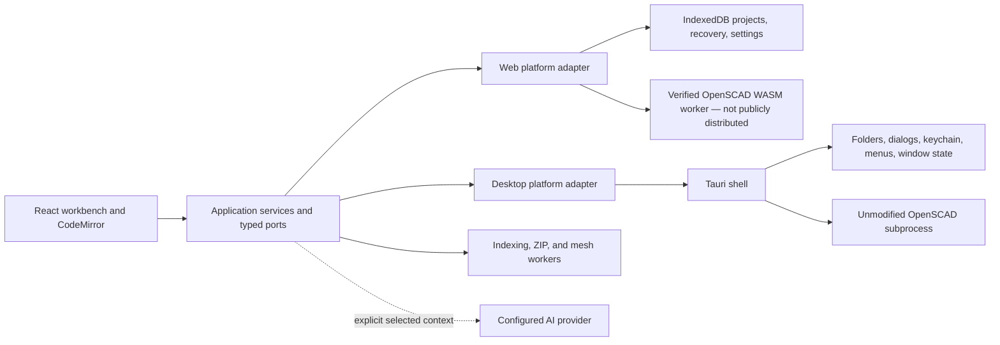

# ScadMill architecture

**Release context:** ScadMill `0.1.0-beta.1` public Windows beta. The source tree also contains implemented web composition work that is not a public hosted product.

**Published architecture guide:** <https://scadmill-beta.sconverse.chatgpt.site/architecture>

ScadMill is a source-first workbench with separate web and desktop compositions. Shared React UI and application code depend on typed capability ports; only platform adapters may touch browser globals, Tauri APIs, the operating system, or an engine process.

## Composition and dependency direction

`src/application/platform` defines the capability records and ports consumed by the product. `src/platform-web` and `src/platform-desktop` construct those capabilities. The source-policy gate prevents shared UI/application code from importing browser adapters, Tauri APIs, or desktop-shell details. Unavailable capabilities are explicit and omitted rather than simulated.

## Engine boundary

The desktop adapter discovers only the exact pin in [`ENGINE_VERSION`](ENGINE_VERSION), then runs the unmodified executable out of process. Each immutable request stages a bounded project, typed parameter overrides, quality, and timeout; captures ordered output; terminates timed-out or cancelled process trees; and validates the returned geometry. Preview uses preview-only policy. Full applies no overrides and is the only export source.

The web-source adapter uses a module worker, verifies the exact JavaScript/WASM pair before execution, and atomically caches the pair. That corresponding-source package and native/WASM parity evidence passed historical M3 gates, but neither a public web app nor engine pair is distributed with the Windows beta.

## State and storage ownership

- Desktop projects remain in user-selected folders. Windows Credential Manager owns desktop secrets.
- Settings, layout, recovery, recent-project metadata, annotations, and optional project cache use typed persistence ports.
- Render-cache persistence is off by default, enabled per project, bounded, integrity-checked, and ineligible for scratch work.
- Editor buffers and command history are application state. The M5 model-history service binds each accepted render to source, parameters, quality, geometry identity, and a thumbnail. Its 100-snapshot session timeline is the default; project persistence is a separate explicit opt-in through a platform port and is capped at 16 MiB.
- Batch export snapshots the active project and selected saved parameter sets once, then serializes full-quality engine/export operations. Each destination write completes before the next item starts, so an item failure or later cancellation cannot roll back an already saved artifact.
- The M5 library manager downloads a pinned catalog package through a CORS-safe GitHub tree/raw-file path (or a user-supplied HTTPS ZIP), filters and validates its bounded runtime files, presents the package license before confirmation, and vendors owned paths plus `scadmill.libraries.json` into the project. Multi-file install/update/remove operations use a snapshot-backed compensation pass; the manifest is written last. Vendored paths such as `BOSL2/std.scad` therefore enter the same immutable project map consumed by native rendering, WASM rendering, and cross-file completion indexing.
- M5 project navigation builds a bounded structural index from the independently authored Lezer OpenSCAD grammar. Search operates on the complete stored text snapshot with unsaved editor overlays, applies root `.gitignore` and `.scadmillignore` rules, and plans replacement offsets before mutation. Closed-file writes happen before open-buffer edits and compensate from the pre-operation sources on failure. Outline, F12 definition resolution, and reference discovery share exact parser locations, avoiding comment/string text matches.
- M5 split editing keeps editor-group membership, order, orientation, and focus as UI state while the existing document workspace remains the single source of buffer content and dirty history. Focusing a group activates its document through the command bus; render/export therefore continue to use the ordinary active-document path. Each group/document pair owns a distinct CodeMirror session, and external activations such as diagnostics or chronological undo reconcile synchronously into the correct group.
- M5 section view remains presentation-only: a bounded axis/offset state drives Three.js local clipping on the current mesh and never changes source or exported geometry. Named camera bookmarks serialize the complete validated camera state through a project-keyed platform persistence port; they do not enter user project files.
- M6 printability analysis consumes only the last full binary-STL presentation. A bounded worker receives a defensive byte copy and returns a strictly decoded report covering topology, model bounds versus configured build volume, and sampled non-adjacent surface separation. Unsupported heuristics are explicit `NOT CHECKED` results; large meshes fail closed instead of running an unbounded UI-thread fallback.
- The M6 engine-version port keeps shared application code independent of native discovery and download authority. Desktop inventory probes are bounded and report the actual executable version plus SHA-256. A user-triggered native installer accepts only the recorded official Windows artifact, refuses redirects, streams under a hard size cap, verifies the archive and executable hashes, and installs atomically into the application-data engine namespace. A strict `scadmill.project.json` pin enters every native render and export request; the native adapter selects the matching managed executable before any default and rejects a version mismatch.
- The M6 headless CLI enters before Tauri window construction. It uses the same native-engine crate, strict project pin, bounded immutable project map, stock parameter-set values, full-quality export path, and printability semantics as the graphical application. JSON is the only command output contract; usage and operational failures have distinct nonzero exit codes.
- Uninstall removes the app and association, not user projects or necessarily every profile/credential record.

## Network and privacy boundaries

ScadMill has no telemetry and operates no ScadMill cloud service. Optional AI requests pass through a bounded native broker directly to the exact configured endpoint, refuse redirects, and contain only the selected conversation context. The local MCP bridge is loopback-only, off by default, permissioned, and review-gated. The public beta has no hosted browser application.

## Workers and responsiveness

Native rendering runs outside the UI process. OpenSCAD WASM execution, project indexing, STL decoding, printability analysis, and browser archive work cross validated worker boundaries. Automatic renders are debounced, superseded work is cancelled, and animation is sequential/backpressured. Workerless fallbacks yield cooperatively where required; large printability inputs refuse a main-thread fallback.

## Desktop shell and installer

Tauri owns OS dialogs, native menus, `.scad` association and single-instance routing, window restoration, credential-store access, and engine process control. The executable dispatches the exact headless command set before creating the Tauri application, so CI automation does not create a window. M6 slicer handoff is another typed desktop-only port: the application first requests an ordinary full-quality 3MF export, then the native adapter writes a unique bounded temp artifact and launches a validated configured executable or one of four bounded passively detected slicer families. The web composition exposes no substitute. The public Windows setup is a signed current-user NSIS installer with an offline WebView2 runtime. A package is not release-qualified until its exact public bytes have passed signature/hash verification and the required isolated lifecycle walkthrough.

## Provenance and supply-chain gates

Non-trivial changes have append-only records under `provenance/entries`. npm and Rust dependency licenses are checked. Engine, toolchain, and relevant packages are pinned. The owner similarity harness runs only in isolated hosted CI. The `0.1.0-beta.1` release also passed hosted CI, a literal one-hour soak, owner-designated Radeon 780M performance evidence, and a clean Windows Sandbox install-to-uninstall walkthrough.

## Extension seams through M6

The ports and worker boundaries support later public web distribution, color/3MF work, and manufacturing estimates. M5 is complete on the development branch, and M6 printability reporting, desktop slicer handoff, engine version management, and headless CLI behavior are implemented there; none is a claim about the current beta. Platform behavior belongs in adapters; reusable behavior belongs in application services; UI consumes declared capabilities.
