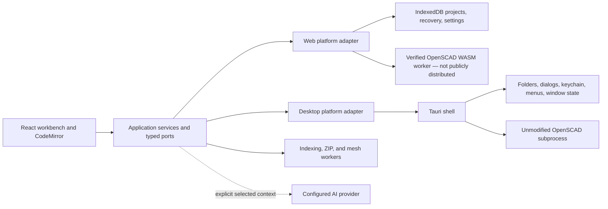

# ScadMill architecture

**Release context:** ScadMill `0.1.0-beta.1` public Windows beta. The source tree also contains implemented web composition work that is not a public hosted product.

**Published architecture guide:** <https://scadmill-beta.sconverse.chatgpt.site/architecture>

ScadMill is a source-first workbench with separate web and desktop compositions. Shared React UI and application code depend on typed capability ports; only platform adapters may touch browser globals, Tauri APIs, the operating system, or an engine process.

## Composition and dependency direction

`src/application/platform` defines the capability records and ports consumed by the product. `src/platform-web` and `src/platform-desktop` construct those capabilities. The source-policy gate prevents shared UI/application code from importing browser adapters, Tauri APIs, or desktop-shell details. Unavailable capabilities are explicit and omitted rather than simulated.

## Engine boundary

The desktop adapter discovers only the exact pin in [`ENGINE_VERSION`](ENGINE_VERSION), then runs the unmodified executable out of process. Each immutable request stages a bounded project, typed parameter overrides, quality, and timeout; captures ordered output; terminates timed-out or cancelled process trees; and validates the returned geometry. Preview uses preview-only policy. Full applies no overrides and is the only export source.

The web-source adapter uses a module worker, verifies the exact JavaScript/WASM pair before execution, and atomically caches the pair. That corresponding-source package and native/WASM parity evidence passed historical M3 gates, but neither a public web app nor engine pair is distributed with the Windows beta.

## State and storage ownership

- Desktop projects remain in user-selected folders. Windows Credential Manager owns desktop secrets.
- Settings, layout, recovery, recent-project metadata, annotations, and optional project cache use typed persistence ports.
- Render-cache persistence is off by default, enabled per project, bounded, integrity-checked, and ineligible for scratch work.
- Editor buffers and history are application state. Every render result is bound to the exact source snapshot that produced it.
- Uninstall removes the app and association, not user projects or necessarily every profile/credential record.

## Network and privacy boundaries

ScadMill has no telemetry and operates no ScadMill cloud service. Optional AI requests pass through a bounded native broker directly to the exact configured endpoint, refuse redirects, and contain only the selected conversation context. The local MCP bridge is loopback-only, off by default, permissioned, and review-gated. The public beta has no hosted browser application.

## Workers and responsiveness

Native rendering runs outside the UI process. OpenSCAD WASM execution, project indexing, STL decoding, and browser archive work cross validated worker boundaries. Automatic renders are debounced, superseded work is cancelled, and animation is sequential/backpressured. Workerless fallbacks yield cooperatively where required.

## Desktop shell and installer

Tauri owns OS dialogs, native menus, `.scad` association and single-instance routing, window restoration, credential-store access, and engine process control. The public Windows setup is a signed current-user NSIS installer with an offline WebView2 runtime. A package is not release-qualified until its exact public bytes have passed signature/hash verification and the required isolated lifecycle walkthrough.

## Provenance and supply-chain gates

Non-trivial changes have append-only records under `provenance/entries`. npm and Rust dependency licenses are checked. Engine, toolchain, and relevant packages are pinned. The owner similarity harness runs only in isolated hosted CI. The `0.1.0-beta.1` release also passed hosted CI, a literal one-hour soak, owner-designated Radeon 780M performance evidence, and a clean Windows Sandbox install-to-uninstall walkthrough.

## Extension seams through M6

The ports and worker boundaries support later public web distribution, installed-library completions, navigation/refactoring, batch operations, headless CLI behavior, color/3MF work, and manufacturing estimates. These are architectural seams, not claims about the current beta. Platform behavior belongs in adapters; reusable behavior belongs in application services; UI consumes declared capabilities.
