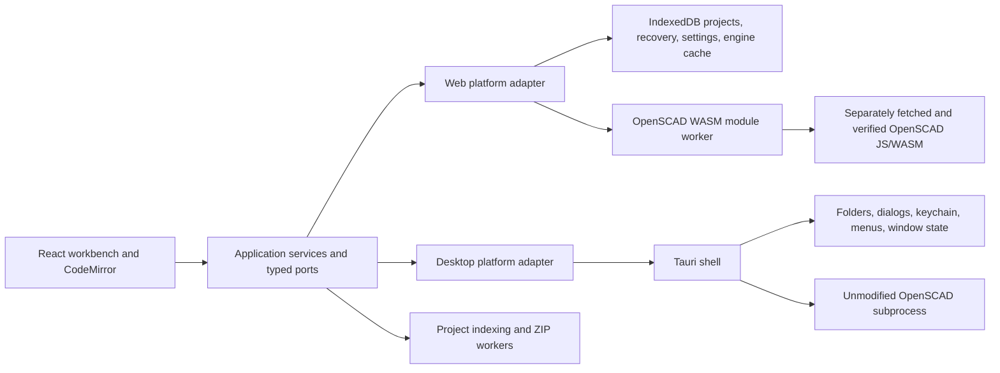

# ScadMill architecture

ScadMill is one source-first workbench with separate web and desktop compositions. Shared application and UI code depend on typed ports; only platform adapters may touch browser globals, Tauri APIs, the operating system, or an engine process.

## Composition and dependency direction

`src/application/platform` defines the capability records and ports consumed by `App` and the workbench. `src/platform-web` and `src/platform-desktop` construct those capabilities. The source-policy gate prevents shared UI/application code from importing browser adapters, Tauri APIs, or desktop-shell implementation details.

Unavailable capabilities are represented explicitly and removed from the relevant UI. The browser therefore does not pretend to support OS trash, reveal-in-file-manager, native file associations, native menus, or a configurable native engine path.

## Engine boundary

The desktop path discovers the exact engine pin in `ENGINE_VERSION` and runs the unmodified executable out of process. Requests stage a bounded project, invoke the engine with deterministic arguments, capture output, enforce preview/full policies, and terminate timed-out or cancelled process trees.

The web path uses a module worker. It fetches the pinned JavaScript/WASM pair as separately addressed static assets, verifies both files before execution, and atomically caches the pair in IndexedDB. Worker messages are decoded as structured values, and failures preserve the editor and local-project features. The desktop build deliberately excludes the public WASM asset directory so those engine bytes never enter desktop resources or installers.

Publishing the web-engine bytes is blocked by Q-0033. Exact native/WASM SVG parity is blocked by Q-0034; no newline or semantic normalization is silently applied.

## State and storage ownership

- Desktop projects live in user-selected folders. The OS credential store owns desktop secrets.
- Browser projects, recovery state, settings, annotations, and the verified engine cache live in browser-managed IndexedDB/local storage.
- Layout persistence is reached through a storage-neutral port. Browser state is profile-owned; desktop project identity is derived from validated canonical identity material returned with the project snapshot.
- Editor buffers and render history are application state. A render result is bound to the exact source snapshot that produced it.

## Workers and responsiveness

OpenSCAD WASM execution, structural project indexing, STL decoding, and browser ZIP work cross worker boundaries. Each boundary validates messages and uses explicit cancellation or bounded work. Workerless fallbacks yield cooperatively where the specification requires continued browser support.

## Desktop shell and installers

Tauri owns OS dialogs, native menus, `.scad` association/single-instance forwarding, window-state persistence, credential-store access, and native engine process control. Windows packages as offline NSIS, macOS as DMG, and Linux as AppImage. An artifact is not release evidence until the exact hashed candidate is installed, launched, exercised, and uninstalled in the required clean environment.

## Provenance and supply-chain gates

Every non-trivial batch has an append-only record under `provenance/entries`. Dependency licenses are checked separately for npm and Rust. Approved reference reads require attribution; unapproved editor/IDE sources remain prohibited. The owner similarity harness runs only in isolated hosted CI and is never executed locally.

## Extension seams through M6

MCP/AI and ordered command history now use the same application ports and platform adapters. Later milestones extend those seams with batch operations, library management and navigation, slicing estimates, color/3MF work, and headless CLI behavior. Platform-specific work belongs in adapters; reusable product behavior belongs in application services; UI remains a consumer of declared capabilities.
