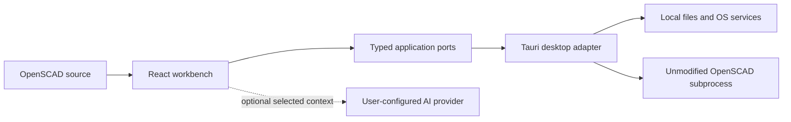

# ScadMill

> **Current public release: `0.1.0-beta.1` for 64-bit Windows.**
> [Download the signed installer](https://github.com/scottconverse/scadmill/releases/download/v0.1.0-beta.1/ScadMill_0.1.0-beta.1_x64-setup.exe) · [Read the user manual](docs/USER-GUIDE.md) · [Verify the release](docs/WINDOWS-BETA.md)

ScadMill is a source-first OpenSCAD workbench. It brings a capable editor, live 2D/3D geometry, project tools, Customizer controls, animation, geometry comparison, and optional AI into one focused desktop application—while keeping ordinary OpenSCAD source as the durable artifact.

  

## What the beta does

- Edits OpenSCAD with syntax support, formatting, completions, diagnostics, multi-file projects, tabs, recovery, and external-change reconciliation.
- Renders real geometry through the unmodified OpenSCAD engine in a separate process.
- Inspects STL and SVG output with orbit, axis views, measurement, annotations, bounds, screenshots, and geometry-change summaries.
- Turns stock Customizer annotations into typed controls without rewriting source unless you explicitly ask.
- Exports full-quality 3MF, STL, OFF, AMF, SVG, DXF, and PNG output supported by the model.
- Animates executable `$t` models through the ordinary preview path with bounded, cancellable rendering.
- Offers optional provider-direct AI assistance, reviewable code changes, a local MCP bridge, and command history.
- Keeps projects local and includes no ScadMill telemetry.

## Honest limits

This is a real beta, not a finished cross-platform release.

- Windows 10/11 x64 is the only public target today.
- Rendering and export require a separate, hash-verified official OpenSCAD `2026.06.12` snapshot. ScadMill does not bundle, modify, replace, or silently accept another version.
- There is no public browser application or OpenSCAD WebAssembly distribution yet.
- macOS, Linux, installed-library expansion, broader navigation/refactoring, batch work, the headless CLI, and manufacturing estimates remain later release work.
- The Radeon 780M was the performance-evidence host; it is not a minimum GPU requirement.

## Install on Windows

1. Download `ScadMill_0.1.0-beta.1_x64-setup.exe` from the [official GitHub release](https://github.com/scottconverse/scadmill/releases/tag/v0.1.0-beta.1).
2. Verify its SHA-256 is `D196878A49804F852C49A81ACBB4AC5C232A88DA737F2D756F9B6376E435A588` and its Windows signature is valid for Scott Converse.
3. Install the exact OpenSCAD `2026.06.12` snapshot and configure its `openscad.exe` path inside ScadMill.
4. Press **F5** for preview or **F6** for full geometry. Exports use full geometry only.

The [Windows beta guide](docs/WINDOWS-BETA.md) gives the exact installer, engine hashes, PowerShell verification commands, setup, update, and uninstall behavior. The [user manual](docs/USER-GUIDE.md) has a plain-language walkthrough, technical reference, architecture guide, troubleshooting, and privacy notes.

## Architecture in one minute



The UI owns the working experience; OpenSCAD owns geometry evaluation. Desktop capabilities remain behind typed adapters. Projects stay in user-selected folders, secrets use Windows Credential Manager, rendering stays out of process, and optional AI traffic goes directly to the configured provider. See [ARCHITECTURE.md](ARCHITECTURE.md) for the full runtime, data, trust, worker, packaging, and extension design.

## Build from source

Requirements: Node.js 24+, pnpm 11.7.0, Rust 1.94.0, and OpenSCAD 2026.06.12 for native-render tests.

```bash
pnpm install --frozen-lockfile
pnpm typecheck
pnpm test
pnpm build
```

Run the web-source development shell with `pnpm dev`. Run the desktop shell with `pnpm desktop`. The public beta is the signed desktop release; the web source tree is not a hosted product.

The public website lives in [`website/`](website/) and has its own `npm ci && npm test` build. `pnpm check:public-surfaces` verifies that product manifests, public documentation, installer facts, and site metadata all name the same current release.

## Security, privacy, and provenance

- Report security issues through [GitHub private vulnerability reporting](https://github.com/scottconverse/scadmill/security/advisories/new), not a public issue.
- Read [PRIVACY.md](PRIVACY.md) before enabling AI, persistent render cache, or local MCP access.
- Dependency licenses, third-party notices, provenance entries, hosted CI, signed packaging, and the isolated owner similarity gate form part of release qualification.
- The project is licensed under [Apache License 2.0](LICENSE).

Contributions must follow [CONTRIBUTING.md](CONTRIBUTING.md) and the clean-room reading/provenance rules in the specification.
