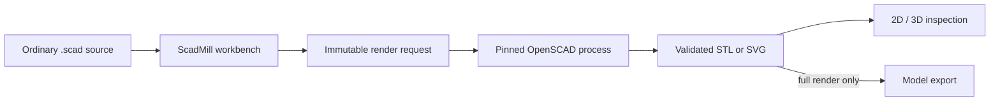
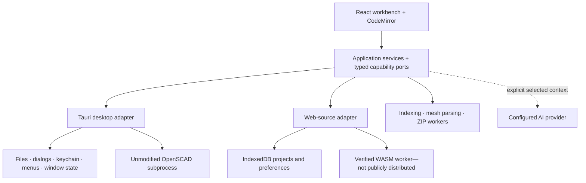

<div align="center">


# ScadMill

### OpenSCAD, without losing the code.

**A source-first CAD workbench for makers who want a capable editor, real geometry, and local project control—while keeping ordinary OpenSCAD source as the durable artifact.**

[Product site](https://scadmill-beta.sconverse.chatgpt.site) · [Download Windows beta](https://github.com/scottconverse/scadmill/releases/download/v0.1.0-beta.1/ScadMill_0.1.0-beta.1_x64-setup.exe) · [User manual](https://scadmill-beta.sconverse.chatgpt.site/manual) · [Architecture](https://scadmill-beta.sconverse.chatgpt.site/architecture)

[](https://github.com/scottconverse/scadmill/releases/tag/v0.1.0-beta.1)
[](https://github.com/scottconverse/scadmill/actions/workflows/ci.yml)
[](docs/WINDOWS-BETA.md)
[](LICENSE)


</div>

> [!IMPORTANT]
> **Current release:** `0.1.0-beta.1` is a signed 64-bit Windows desktop beta. Rendering requires a separate, hash-verified official OpenSCAD `2026.06.12` snapshot. ScadMill does not bundle or modify OpenSCAD.

## Why ScadMill

OpenSCAD makes models reproducible because the design is code. ScadMill builds a focused working environment around that idea: edit a multi-file project, turn Customizer declarations into controls, render through the real OpenSCAD engine, inspect the result, and export full-quality geometry without converting the project into a private document format.

| | |
|---|---|
| **Code stays first** | Syntax-aware editing, formatting, completions, diagnostics, tabs, recovery, external-change reconciliation, and project-relative dependencies. |
| **Geometry is real** | Preview and full rendering run through the unmodified OpenSCAD engine. Only full results may be exported. |
| **Models stay local** | Desktop projects remain in folders you choose. ScadMill includes no telemetry and operates no cloud service. |
| **Automation stays reviewable** | Optional provider-direct AI and the local MCP bridge use selected context, explicit permissions, and review-gated mutations. |

## What you can do today

### Write and organize

- Work in folder-backed, multi-file OpenSCAD projects with tabs, binary assets, `include`/`use` resolution, and ZIP portability.
- Use a purpose-built OpenSCAD grammar, syntax highlighting, completions, parse-gated formatting, diagnostics, in-file and ignore-aware project search/replace, structural outline, cross-file definition/reference navigation, configurable shortcuts, and light, dark, or high-contrast themes.
- Recover unsaved buffers after interruption and resolve disk changes with inline or side-by-side differences.

### Render and inspect

- Press <kbd>F5</kbd> for fast preview geometry or <kbd>F6</kbd> for an unrestricted full render.
- Orbit, pan, zoom, fit, switch projections and axis views, measure geometry, pin annotations, and capture PNG screenshots in the 3D viewer.
- Inspect sanitized 2D SVG output with pan, zoom, scale, and model-space dimensions.
- See geometry identity and changes in volume, bounds, and triangle count between successful renders.
- Animate models that use executable `$t` through a bounded, cancellable, sequential render loop.

### Parameterize and export

- Turn stock OpenSCAD Customizer declarations into typed controls without silently rewriting source.
- Save, import, and export named parameter sets in the stock JSON format.
- Export full-quality 3MF, binary or ASCII STL, OFF, AMF, SVG, DXF, and PNG where supported by the model.

### Extend—with consent

- Configure optional OpenAI-compatible, Anthropic, or local AI providers with separately scoped secrets stored in Windows Credential Manager.
- Choose exactly which source, diagnostics, parameters, or viewer image enters an AI request; proposed edits remain reviewable per hunk.
- Connect a local MCP client through the desktop application. Mutation tools are denied by default and enter the History review surface before changing a project.

## From source to geometry



ScadMill owns editing, project state, parameters, viewers, and review flows. OpenSCAD remains the geometry authority and runs out of process. Failed, cancelled, stale, or unavailable results are shown as such while the last good geometry remains intact.

## Install and render your first model

1. Download [`ScadMill_0.1.0-beta.1_x64-setup.exe`](https://github.com/scottconverse/scadmill/releases/download/v0.1.0-beta.1/ScadMill_0.1.0-beta.1_x64-setup.exe) from the official release.
2. Verify SHA-256 `D196878A49804F852C49A81ACBB4AC5C232A88DA737F2D756F9B6376E435A588` and a valid Windows signature from Scott Converse.
3. Download and verify the required official [OpenSCAD `2026.06.12` Windows snapshot](docs/WINDOWS-BETA.md#install-the-required-openscad-engine).
4. Start ScadMill, choose **Configure engine**, and select the verified `openscad.exe`.
5. Enter `cube([20, 20, 20]);`, press <kbd>F5</kbd>, and orbit the rendered cube.

```powershell
# Verify the downloaded ScadMill installer before running it.
Get-FileHash -Algorithm SHA256 -LiteralPath .\ScadMill_0.1.0-beta.1_x64-setup.exe
Get-AuthenticodeSignature -LiteralPath .\ScadMill_0.1.0-beta.1_x64-setup.exe |
  Format-List Status, StatusMessage, SignerCertificate
```

The installer is current-user, includes normal uninstall support and an offline WebView2 runtime, and registers `.scad` files. The [Windows beta guide](docs/WINDOWS-BETA.md) documents exact engine hashes, setup, update, rollback, and uninstall behavior.

## Architecture



The shared application depends on capabilities, not operating-system APIs. Desktop and browser-source adapters supply those capabilities separately; unavailable behavior is omitted rather than simulated. This keeps file access, process control, persistence, secrets, and optional network traffic behind explicit trust boundaries.

Read the [architecture guide](ARCHITECTURE.md) for the runtime composition, render lifecycle, data ownership, failure model, worker boundaries, packaging, and supply-chain controls.

## Privacy and security posture

- **No ScadMill telemetry or hosted model service.** Projects and application state remain local unless you deliberately invoke a configured provider.
- **Provider-direct AI.** The desktop broker refuses redirects and sends only the conversation and context selected in the panel to the configured endpoint.
- **OS-backed secrets.** Desktop AI credentials live in Windows Credential Manager and are excluded from settings exports.
- **Local MCP boundary.** The bridge is off by default, loopback-only, permissioned, and review-gated.
- **Pinned execution.** Rendering rejects an OpenSCAD executable that does not match the recorded engine version.

Report suspected vulnerabilities through [GitHub private vulnerability reporting](https://github.com/scottconverse/scadmill/security/advisories/new). Do not post sensitive details in a public issue. See [SECURITY.md](SECURITY.md) and [PRIVACY.md](PRIVACY.md).

## Current product status

| Surface or capability | Status in `0.1.0-beta.1` | Notes |
|---|---:|---|
| Windows 10/11 x64 desktop | **Public beta** | Signed installer; install, update, restart, recovery, and uninstall paths have retained evidence. |
| Editing, projects, Customizer, native render, viewers, export | **Available** | Requires the separately installed exact OpenSCAD snapshot for rendering and export. |
| Animation, render cache, geometry delta, thumbnails | **Available** | Persistent render caching is opt-in per project and off by default. |
| Optional AI and local MCP | **Beta** | Provider configuration and MCP permissions are explicit; there is no ScadMill AI proxy. |
| Browser-source composition and OpenSCAD WASM path | **Implemented, not distributed** | No public browser application or WASM engine package is offered by this release. |
| macOS and Linux installers | **Not released** | Windows desktop is the approved first public target. |
| M5 history, batch export, libraries, intelligence, navigation, split editor, section view, camera bookmarks | **Implemented on `main`, not in this beta** | Development builds add the complete M5 scope, including a real axis-aligned clipping plane and per-project named camera views. |
| M6: printability, slicer handoff, engine manager, headless CLI, color/parts, colored 3MF, manufacturing estimates | **In progress on `main`, not in this beta** | Printability reporting, desktop slicer handoff, per-project engine management, and the headless CLI are implemented; color/parts preview, colored 3MF, and manufacturing estimates remain before the complete-product milestone closes. |

> [!NOTE]
> The Radeon 780M was the release performance-evidence host. It is **not** a minimum GPU requirement.

## Release evidence

The public installer is not inferred from a successful source build. Its exact bytes are bound to retained release evidence:

- Hosted TypeScript/browser and Rust/native CI
- Isolated owner-run similarity gate that keeps prohibited comparison repositories away from implementers
- Signed-installer hash and Authenticode verification
- Clean Windows Sandbox install-to-uninstall walkthrough
- One-hour edit/render reliability soak with engine-kill recovery
- Owner-designated Radeon 780M two-million-triangle viewer qualification
- Dependency-license, third-party-notice, source-policy, and append-only provenance checks

See the [release notes](docs/RELEASE-NOTES-0.1.0-beta.1.md), [verification guide](docs/WINDOWS-BETA.md), and [provenance ledger](PROVENANCE.md) for the exact boundaries of those claims.

## Documentation

| Guide | Use it for |
|---|---|
| [User manual](docs/USER-GUIDE.md) | Plain-language onboarding, technical reference, architecture, troubleshooting, privacy, and uninstall behavior |
| [Windows beta guide](docs/WINDOWS-BETA.md) | Installer and engine hashes, installation, configuration, verification, update, and removal |
| [Architecture](ARCHITECTURE.md) | Runtime boundaries, storage, workers, native/WASM paths, packaging, and extension seams |
| [FAQ](docs/FAQ.md) | Preview vs full, engine pinning, recovery, AI, MCP, browser status, and later capabilities |
| [Privacy](PRIVACY.md) | Local data, recovery, caches, secrets, AI traffic, and MCP behavior |
| [Security](SECURITY.md) | Supported release and confidential vulnerability reporting |

<details>
<summary><strong>Build from source</strong></summary>

### Requirements

- Node.js 24 or newer
- pnpm `11.7.0`
- Rust `1.94.0`
- OpenSCAD `2026.06.12` for native-render verification

```bash
pnpm install --frozen-lockfile
pnpm typecheck
pnpm test
pnpm build
```

Run the browser-source development shell with `pnpm dev`. Run the Tauri desktop shell with `pnpm desktop` after configuring the required engine. The source web composition is a development and verification target—not a hosted ScadMill product.

The informational website lives in [`website/`](website/). Its independent build uses `npm ci && npm test` from that directory. `pnpm check:public-surfaces` verifies the release version, installer identity, public documents, and website metadata as one contract.

</details>

## Contributing

ScadMill welcomes contributions, but its clean-room provenance rules are part of the engineering contract. Read [CONTRIBUTING.md](CONTRIBUTING.md), the [specification](spec/scadmill-spec-v0.6.md), and [PROVENANCE.md](PROVENANCE.md) before changing product code.

The codebase offers clear extension points through typed platform capabilities, isolated engine adapters, bounded workers, application services, and test fixtures. Every behavior change begins with an observed failing test and adds a machine-readable provenance entry.

## License

ScadMill's original application code is available under the [Apache License 2.0](LICENSE). OpenSCAD and other dependencies retain their own licenses; distribution attributions are recorded in [THIRD-PARTY-NOTICES.txt](THIRD-PARTY-NOTICES.txt).
